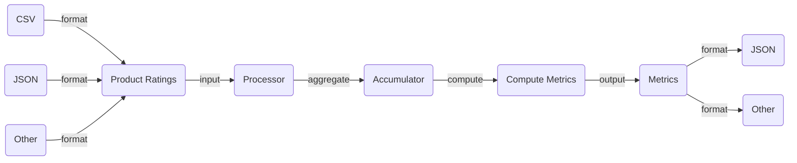

# Introduction
- Java Application that reads a large corpus of product ratings, processes them, and computes relevant metrics. 
- Uses the Java API for Bean Validation (JSR 380) to ensure that fields meet specific criteria in a declarative format.
- Ability to read the points from different sources: binary file, JSON, etc. 
- Provides support for reading the input in a lazy fashion through iterators. 
- Optimally determines the top k best rated and worst rated products by using a Priority Queue. 

# Architecture 
- Input: corpus of product ratings
- Output: rating metrics



# Solution
### Technologies
- Java
- Spring
- Gradle

### Package Structure
- `comparators`: logic for comparing ratings; abstracts different comparing possibilities
- `configuration`: bean creation
- `converters`: logic for transforming different types of objects
- `models`: model objects
- `processor`: product ratings processor logic
- `reader`: logic for reading the corpus of product ratings from different sources; abstracts reading sources
  - Provides support for reading the input in a lazy fashion through iterators and streams
- `writer`: logic for printing the results; abstract writing sources


### Conceptual Approach
The central piece of the solution revolves around processing and aggregating the corpus of product ratings in an efficient manner:

- Read the corpus of product ratings
- Process and aggregate the ratings
- Compute the metrics
- Write metrics

### Algorithmic approach
- The most rated and least rated products can be determined in O(n) using a linear scan.
- Determining the top k best rated and worst rated products can be solved optimally using a Priority Queue as follows:
  - Initialize a Priority Queue (Heap) using the required comparator
  - Sets its size to the maximum number of elements to store in it
  - Reads the input elements one by one and adds them to the Heap
  - The heap does not grow over the maximum number of points
  - Complexity
    - Assuming n is number of points and k number of max elements to determine
    - Time: O(n log k), practically O(n) when the max elements to determine is small
    - Memory: O(k), practically O(1) for small number of elements

# Input file CSV Structure
- `Buyer Id`: alphanumeric, starts with letter	
- `Shop Id`: alphanumeric, starts with letter
- `Product Id`: alphanumeric and -, starts with letter, ends in -[01-99]	
- `Rating`: 1-5

Consult the test files for more information.

# Output JSON Structure
```json
{
  "validLines" : 100,
  "invalidLines" : 8,
  "bestRatedProducts" : [ "product-01", "product-02", "product-03" ],
  "worstRatedProducts" : [ "product-04", "product-05", "product-06" ],
  "mostRatedProduct" : "product-07",
  "leastRatedProduct" : "product-08"
}

```

# Testing
- Parameterized tests for the entire logic

### CMD
You might need to make gradlew or gradlew.bat executable.

```groovy
./gradlew clean test

```

### IDE
Import project in your IDE and run them from the IDE.


# Prerequisites
- Java 11 or Java 13 is available on your system (tested with Java 13)
- Make sure that the CSV file for the input product ratings has the require structure. You can consult the test files for more info.
  
# Running the application

### Params
- The corpus of product ratings: initialize `ratings.path` with the path to the product ratings file. Escape the path if required. 
- Number of max rated products for best reated and worst rated products: `max.rated.products` should be initialized with the desired number.
- There will be multiple `spring.profiles.active` properties:
  - Reading strategy: initialize `spring.profiles.active` with one of `[csv.reader]`. 
  - Printing strategy: initialize `spring.profiles.active` with one of `[command.line.writer, captor.writer]`
    - Use `command.line.writer` most of the time
    - `captor.writer` is relevant for testing 

### CMD

```groovy
$ ./gradlew -q bootRun -Pargs=--ratings.path=<path-to-file>,--max.rated.products=<number>,--spring.profiles.active=csv.reader,--spring.profiles.active=command.line.writer
```

You can pipe the execution to a file, if you want to store the results for later analysis.

### Notes
- This should also work under Windows using Git Bash. Otherwise, use the `gradlew.bat` version for pure Windows systems.
- If you also want to see the running time, add `time` before the previous command, if available on your system.

### Errors
- Please consult the contents of the `application.log` file if problems arise. This can be found in the root directory.

# Assumptions
- If there are multiple products with the same average rating, any of them can be selected for the output metrics
- If there are multiple products with the same number of ratings, any of them can be selected for the output metrics
- The file doesn't contain any duplicate ratings (multiple ratings for the same product by the same user)
- Some lines might be invalid, count them and continue with the rest

# Future directions
- Add different reading sources
- Add different writing sources

